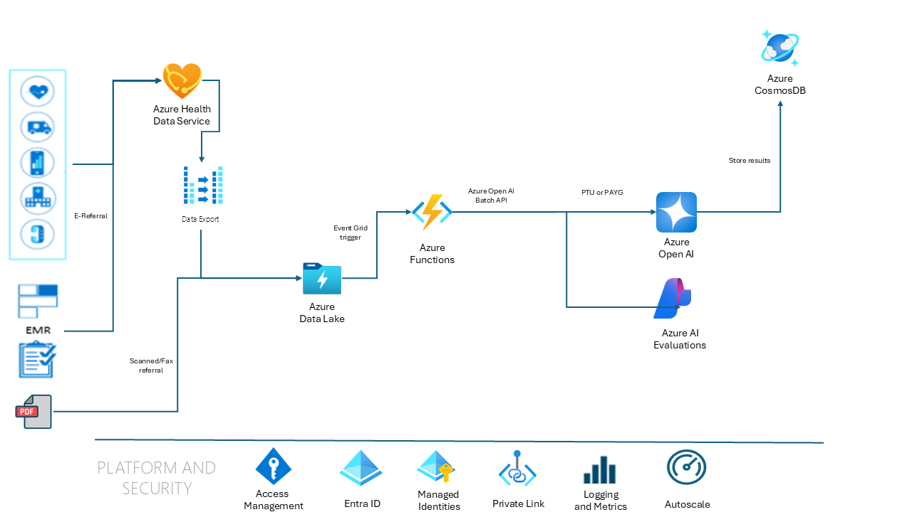

# Patient Referral System

This approach takes advantage of the GPT-4o model's ability to understand the structure of a document and extract the relevant information using vision capabilities. This approach provides the following advantages:

* No requirement to train a custom model: GPT-4o is a pre-trained model that can be used to extract structured data from PDF documents without the need to train a custom model for your specific document types. This can save time and resources, especially for organizations that need to process a wide variety of document types.
* Extraction by prompt engineering: GPT-4o can extract structured data from documents with a defined JSON schema provided as a one-shot learning technique. This instructs the model to extract data is a defined format, providing a high level of accuracy for downstream processing.
* Ability to extract data from complex documents: GPT-4o can extract structured data from complex visual elements in documents, such as invoices, that contain tables, images, and other non-standard elements.

## Document extraction and analysis pattern on Azure

1. Data Ingestion: Patient Referral documents are acquired from tertiary systems (email, fax, eReferral systems) and deposited on an Azure Data Lake.  There are numerous methods that allow you to ingest data from the various sources into Azure Data Lake. For instance, you can use Azure Logic Apps to automatically trigger the ingest from a tertiary system into Azure Data Lake. For simplicity, data processing for this solution architecture starts with the Azure Data Lake.
2. Event-driven automation: An Azure Event Grid trigger, configured to detection a blob creation event, calls an Azure Function App.
3. Application Orchestrator (for example, using Azure Functions): Azure Functions can be used to orchestrate the flow of data, for example, sending prompts to Azure OpenAI and handling the responses. Azure Functions are serverless and event-driven, meaning they scale automatically to handle incoming traffic.
4. Azure Machine Learning and Prompt Flow: Azure Machine Learning's Prompt Flow feature allows you to prototype, experiment, and iterate on your AI applications by linking LLMs, prompts, and Python tools in a visualized graph. It helps in debugging, sharing, and iterating your flows, creating prompt variants, and evaluating their performance.
5. Interacting with Azure OpenAI: Azure OpenAI can be integrated into applications, products, or services. The API offers system message functionality, which can be used to provide real-time guidance or important information to the user during the conversation.
6. Content Management in Azure OpenAI: Azure OpenAI offers content management features that can be modified for specific use cases, especially when dealing with sensitive or confidential data. This requires meeting certain eligibility criteria and completing the modified access form.
